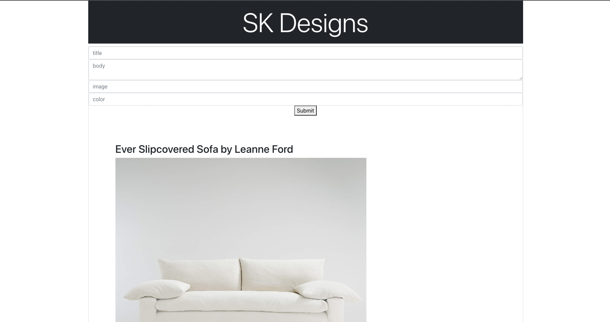
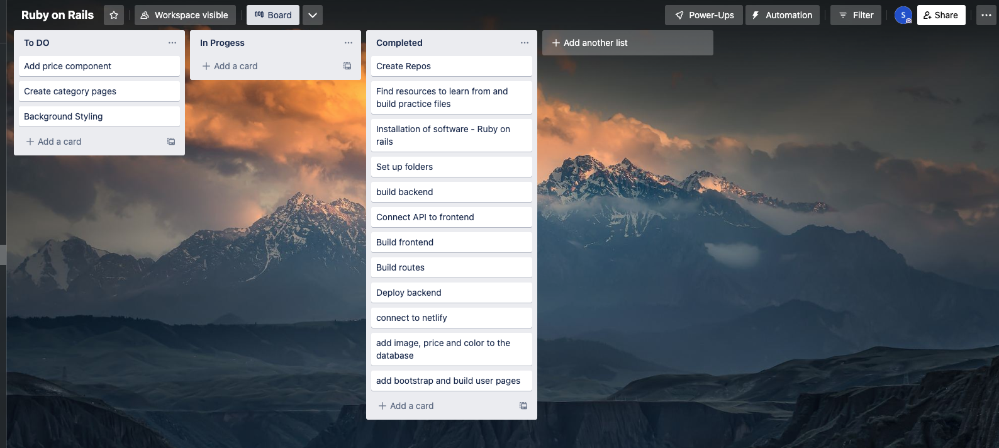

# Rails_React_FurnitureStore

# SK Designs
---

### Project Description:  SK Designs is a full CRUD-RAILS-REACT application. 

---

### User Stories 

#### An admin account to add, update,delete user data

### App Screenshot
#### 
#### 

---

### Wireframes
#### 

---

### ERD

#### title-String
#### body-String
#### image-String
#### price-Number
#### color-String

---

### Technologies Used:
#### 1. Rails Scaffold
#### 2. Ruby
#### 3. React
#### 4. Netlify
#### 5. Trello
#### 6. VS Code
#### 7. Typescript
#### 8. Bootstrap

---

### Getting Started: 
#### TRELLO BOARD: 

---

#### Netlify Frontend Link: https://eclectic-alfajores-0d20ee.netlify.app/
#### Render Backend Link: https://react-crud-furniturestore.onrender.com/furnitures
#### Github Backend: https://github.com/sonamkaria/Rails_React_FurnitureStore
#### Github Frontend:https://github.com/sonamkaria/Rails_React_FurnitureStore_frontend

---

### Future Enhancements: 
#### 1. Add Search Bar
#### 2. Expand dataset to include more tables
#### 3. Styling
